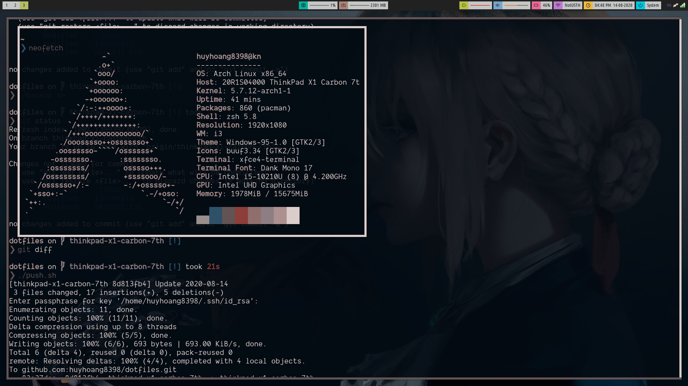

## Preview 


## Note 
### To make audio work on Archlinux
```bash
yay -S pulseaudio-git
sudo pacman -S pulseaudio-alsa --assume-installed pulseaudio
```

Socket is enabled by default:
```bash
systemctl --user status pulseaudio.socket
```
If you want pulseaudio to start right after login:
```bash
systemctl --user enable pulseaudio
```

### TLP, battery threshold 

```bash
sudo pacman -S tlp acpi_call tpacpi-bat
sudo systemctl enable tlp.service
sudo systemctl enable tpacpi-bat
```
Change desire value for battery threshold 
```
sudo nvim /etc/conf.d/tpacpi
reboot
```
Validate:
```bash
sudo tlp-stat -b
```
