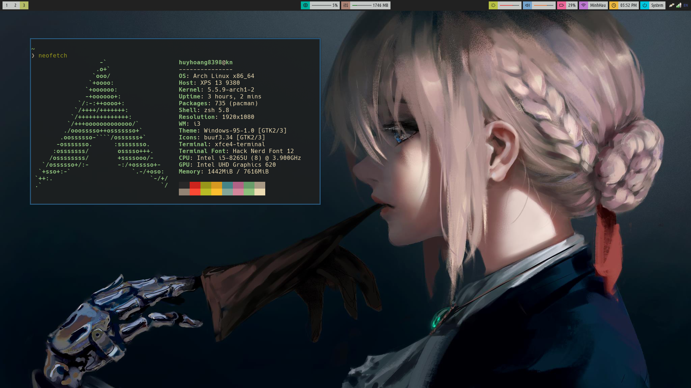
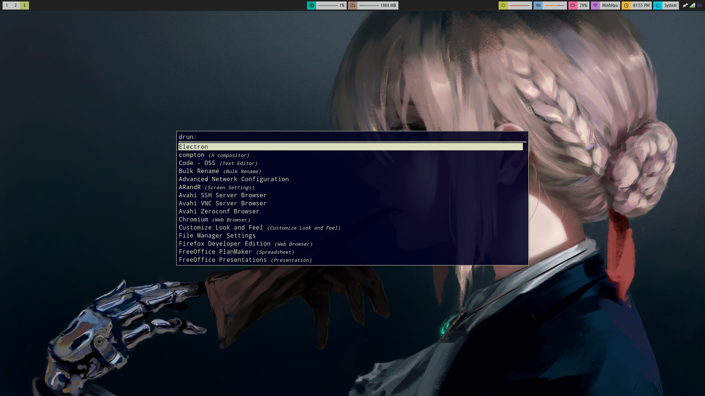
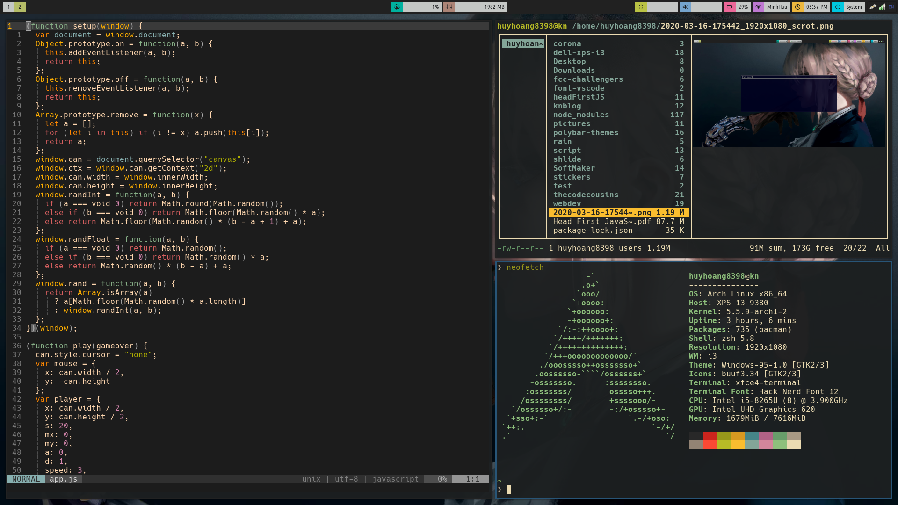

# i3 rice : kn





```
Copy "i3" to "~/.config/i3"
Copy "polybar" to "~/.config/polybar"
Copy "vim/vimrc" to "~/.vimrc"
Copy "xinitrc" to "~/.xinitrc"
Copy "zshrc" to "~/.zshrc"
```

# Dependencies
- [i3-gaps](https://github.com/Airblader/i3)
- [polybar](https://github.com/jaagr/polybar)
- [rofi](https://github.com/DaveDavenport/rofi)
- [betterlockscreen](https://github.com/pavanjadhaw/betterlockscreen)
- [FontAwesome](https://github.com/FortAwesome/Font-Awesome)
- [powerline (fonts)](https://github.com/powerline/fonts)
- [Noto Sans](https://fonts.google.com/specimen/Noto+Sans)
- [Roboto](https://fonts.google.com/specimen/Roboto)
- [RobotoMono](https://fonts.google.com/specimen/Roboto+Mono)
- [screenfetch](https://github.com/KittyKatt/screenFetch)
- [cava](https://github.com/karlstav/cava)
- rtv
- newsboat
- cmus
- feh
- scrot
- imagemagick
- ibus
- xfce4-screenshooter
- st (with alpha patch)
- zsh
- [oh-my-zsh](https://github.com/robbyrussell/oh-my-zsh)
- gtk3
- [ag](https://github.com/ggreer/the_silver_searcher)
- xdg-user-dirs
- vim
- [fdir](https://github.com/RealtimeBagIdea/FDir)
- nm-applet
- xrdb

# Desktop themes
- [Window 95](https://b00merang.weebly.com/windows-95.html)
- [Buuf Icon](http://buuficontheme.free.fr/)

